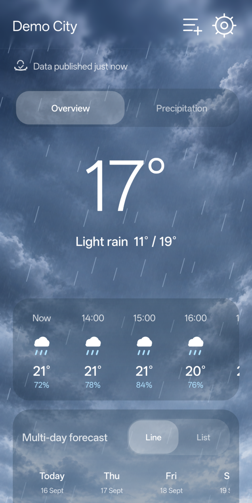
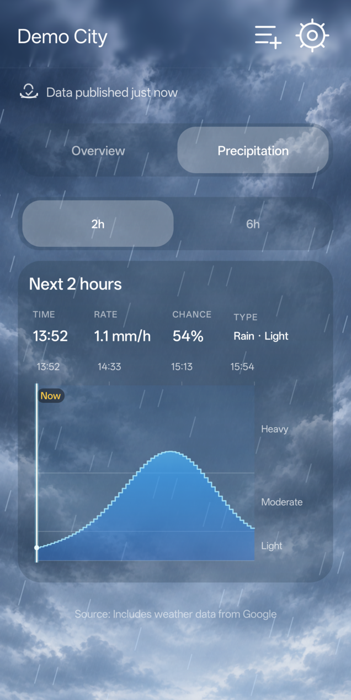
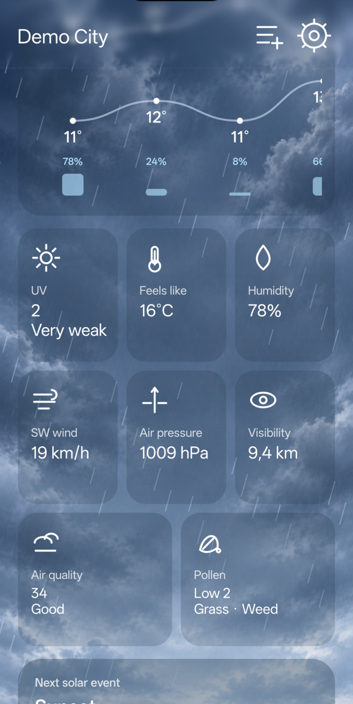
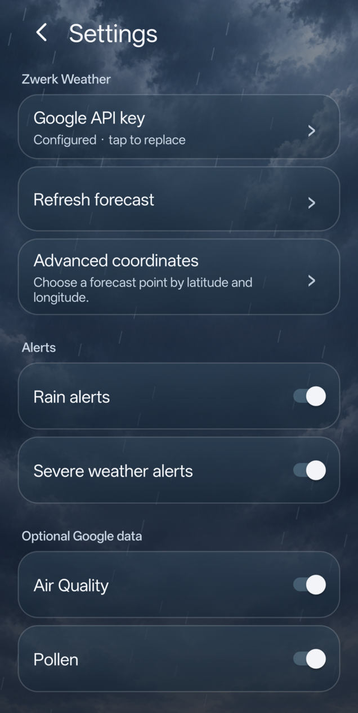
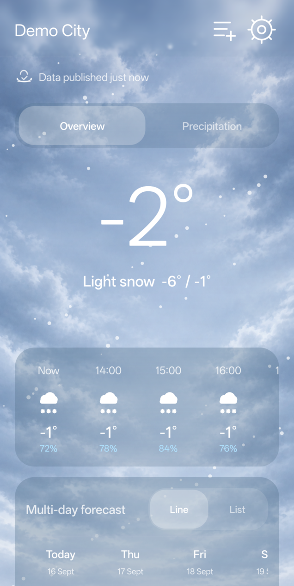

# Zwerk Weather

Zwerk Weather is an open-source, ad-free Android weather app using the Google Maps Platform Weather API, powered by WeatherNext 3.

Inspired by OnePlus Weather, it includes minute precipitation forecasts, responsive widgets, optional air quality and pollen data, and animated forecast scenes.

Licensed under the [Apache License 2.0](LICENSE).

<p align="center">
  
  
  
  
</p>

<p align="center">
  
</p>

## WeatherNext 3

Zwerk Weather uses Google's Weather API for its weather data. As of September 2026, Google states that **WeatherNext 3 powers weather experiences in the Google Maps Platform Weather API**.

## Highlights

- Current conditions, a horizontally scrollable hourly forecast, and a 10-day line/list forecast.
- Expandable day cards with detailed hourly temperature, precipitation, wind, pressure, and visibility.
- Minute precipitation graph with 2-hour and 6-hour views, using two-minute selection steps when returned coverage permits it.
- Smooth day, night, rain, snow, fog, and thunder scenes.
- Scene-aware glass surfaces and a progressive top gradient blur. Supported OnePlus devices use the OEM gradient-blur path; other devices use the portable fallback.
- Android widget with a compact layout at small sizes and a five-hour strip at normal 4×2 sizes.
- Per-API daily and monthly request caps default to Google's free tier to help avoid unexpected Weather, Air Quality, and Pollen billing.

## Privacy and monetization
* **No ads.**
* No paid subscription is required.
* No account is required.
* Weather requests are made using the Google Cloud API key configured by the user.

## Requirements

- Android 9 or newer (API 28+).
- A Google Cloud project with billing configured.
- [Weather API](https://developers.google.com/maps/documentation/weather/get-api-key) enabled.
- Optional: [Air Quality API](https://developers.google.com/maps/documentation/air-quality/get-api-key) and [Pollen API](https://developers.google.com/maps/documentation/pollen/get-api-key).

The minute forecast is an [experimental Weather API feature](https://developers.google.com/maps/documentation/weather/minute-forecast). Availability and returned coverage can vary by location and project access.

## API key setup

1. Create or select a Google Cloud project and enable billing.
2. Enable Weather API. Enable Air Quality API and Pollen API only if you want those optional tiles.
3. Create an API key in **APIs & Services → Credentials**.
4. Restrict the key to only the enabled APIs. If you also use an Android application restriction, use the package name `com.zwerk.weather` and the signing-certificate SHA-1 displayed by the app's setup/help screen.
5. Open Zwerk Weather and paste the key into the startup setup dialog.

### `API_KEY_SERVICE_BLOCKED`

If an Air Quality or Pollen tile reports that the key is blocked, tap the tile for exact help. Usually the fix is to:

1. Enable that API in the same Google Cloud project as the key.
2. Add Weather API, Air Quality API, or Pollen API to the key's API restrictions as applicable.
3. Confirm billing is active.
4. If Android restrictions are enabled, verify the exact package name and signing SHA-1 shown by the app.
5. Save the changes, allow a few minutes for propagation, and pull down to refresh.

## Install

Download the APK from this repository's Releases page and allow installation from your browser or file manager, or use ADB:

```powershell
adb install -r .\Zwerk-Weather-1.0.2.apk
```

## App updates

Zwerk Weather checks the repository's latest stable GitHub Release at most once per day and also
offers a manual **Check for updates** action in Settings.

## Build

Use JDK 17 and Android SDK 36:

```powershell
.\gradlew.bat :app:assembleDebug :app:lintDebug --no-daemon
```

## Project status and responsibility

Zwerk Weather is not affiliated with or endorsed by Google or Google DeepMind.

Users are responsible for their own Google Cloud project, billing, credential restrictions, regional eligibility, usage, and compliance with the applicable terms. Google uses different Maps Platform service terms based on billing-account address: [general terms](https://cloud.google.com/maps-platform/terms/maps-service-terms) and [EEA terms](https://cloud.google.com/terms/maps-platform/eea/maps-service-terms). Google attribution remains visible in the app.
