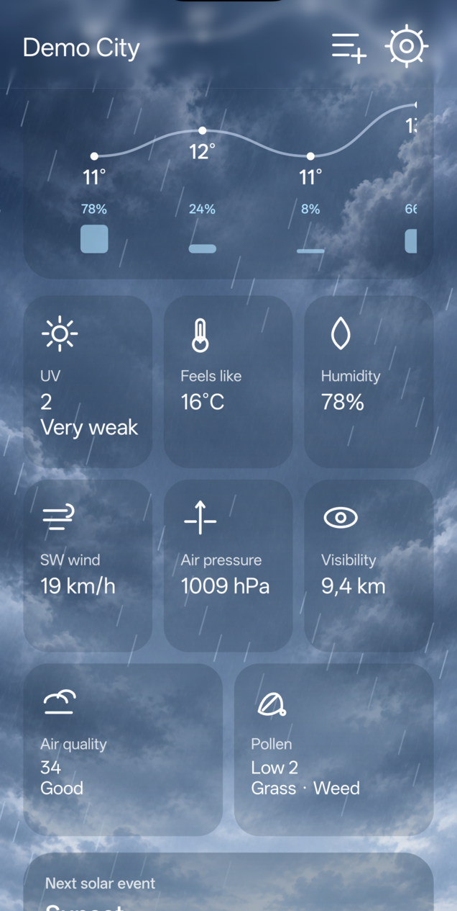
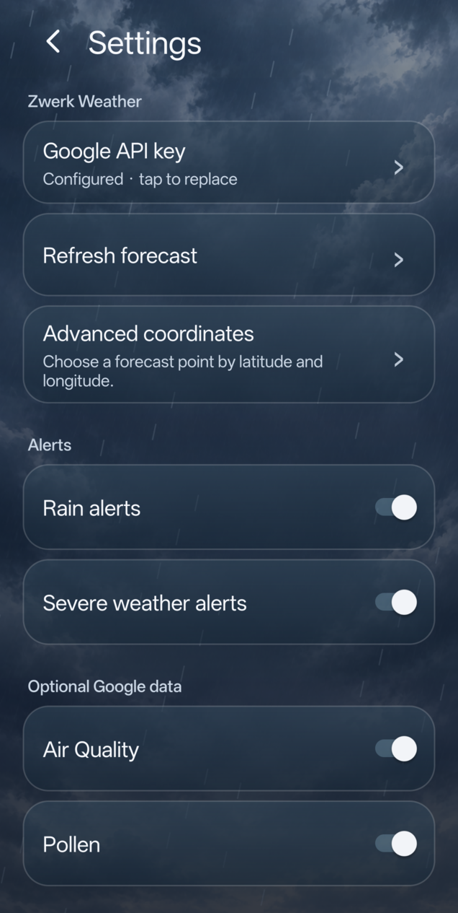

# Zwerk Weather

Zwerk Weather is an open-source, ad-free Android weather app with Google Weather and Open-Meteo forecast sources.

Inspired by OnePlus Weather, it includes minute precipitation forecasts, responsive widgets, optional air quality and pollen data, and animated forecast scenes.

Licensed under the [Apache License 2.0](LICENSE).

<p align="center">
  
  
  
  
</p>

<p align="center">
  
</p>

## WeatherNext 3

When Google Weather is selected, Zwerk Weather uses the Google Maps Platform Weather API, powered by WeatherNext 3. Open-Meteo is available without a key for noncommercial use.

## Highlights

- Current conditions, a horizontally scrollable hourly forecast, and a 10-day line/list forecast.
- Expandable day cards with detailed hourly temperature, precipitation, wind, pressure, and visibility.
- Minute precipitation graph with 2-hour and 6-hour views, using two-minute selection steps when returned coverage permits it.
- Optional swipeable precipitation and radar pages. RainViewer radar includes a past-2-hour timeline; Google Weather maps show current precipitation where supported.
- Smooth day, night, rain, snow, fog, and thunder scenes.
- Android widget with a compact layout at small sizes and a five-hour strip at normal 4×2 sizes.
- Separate local request counts and adjustable caps for Google and Open-Meteo.
- Open-Meteo model selection, 15-minute precipitation, and optional air quality and pollen.

## Privacy and monetization
* **No ads.**
* No paid subscription is required.
* No account is required.
* Open-Meteo needs no key for noncommercial use. Google Weather uses the user's Google Cloud API key.

## Requirements

- Android 9 or newer (API 28+).
- Open-Meteo: no key for noncommercial use; an optional customer key for paid plans.
- Google Weather: a Google Cloud project with billing and [Weather API](https://developers.google.com/maps/documentation/weather/get-api-key) enabled.
- Google optional data: [Air Quality API](https://developers.google.com/maps/documentation/air-quality/get-api-key) and [Pollen API](https://developers.google.com/maps/documentation/pollen/get-api-key).

The minute forecast is an [experimental Weather API feature](https://developers.google.com/maps/documentation/weather/minute-forecast). Availability and returned coverage can vary by location and project access.

## Radar sources

Choose the source in the Radar tab itself. RainViewer is the recommended default; it needs no API key and loads historical radar tiles only while the page is open. Downloaded OpenStreetMap tiles are cached for 14 days; radar frames are cached for up to 3 hours.

Open-Meteo does not provide radar map tiles. RainViewer radar remains available with either forecast source.

Google Weather maps use the app's existing user-provided Google API key. They currently provide a **current** precipitation layer for supported US and European areas, without a playback timeline. The app counts their tile requests against the Weather API limit and caches them for 10 minutes. Google's [experimental weather-map documentation and terms](https://developers.google.com/maps/documentation/weather/weather-map) restrict using this content in an app whose primary purpose is weather information; review those terms before selecting Google. The app does not include a shared provider key.

## API key setup

Select Open-Meteo in Settings to use weather forecasts without a key. Choose Best Match or a specific forecast model there. Air quality and seasonal pollen are also available from Open-Meteo. A paid customer key can be added in Settings.

For Google Weather:

1. Create or select a Google Cloud project and enable billing.
2. Enable Weather API. Enable Air Quality API and Pollen API only if you want those optional tiles.
3. Create an API key in **APIs & Services → Credentials**.
4. Restrict the key to only the enabled APIs. If you also use an Android application restriction, use the package name `com.zwerk.weather` and the signing-certificate SHA-1 displayed by the app's setup/help screen.
5. Open Zwerk Weather and paste the key into the startup setup dialog.

### `API_KEY_SERVICE_BLOCKED`

If an Air Quality or Pollen tile reports that the key is blocked, tap the tile for exact help. Usually the fix is to:

1. Enable that API in the same Google Cloud project as the key.
2. Add Weather API, Air Quality API, or Pollen API to the key's API restrictions as applicable.
3. Confirm billing is active.
4. If Android restrictions are enabled, verify the exact package name and signing SHA-1 shown by the app.
5. Save the changes, allow a few minutes for propagation, and pull down to refresh.

## Install

Download the APK from this repository's Releases page and allow installation from your browser or file manager, or use ADB:

```powershell
adb install -r .\Zwerk-Weather-1.2.0.apk
```

## App updates

Zwerk Weather checks the repository's latest stable GitHub Release at most once per day and also
offers a manual **Check for updates** action in Settings.

## Build

Use JDK 17 and Android SDK 36:

```powershell
.\gradlew.bat :app:assembleDebug :app:lintDebug --no-daemon
```

## Project status and responsibility

Zwerk Weather is not affiliated with or endorsed by Google or Google DeepMind.

Users are responsible for their own Google Cloud project, billing, credential restrictions, regional eligibility, usage, and compliance with the applicable terms. Google uses different Maps Platform service terms based on billing-account address: [general terms](https://cloud.google.com/maps-platform/terms/maps-service-terms) and [EEA terms](https://cloud.google.com/terms/maps-platform/eea/maps-service-terms). Google attribution remains visible in the app.
