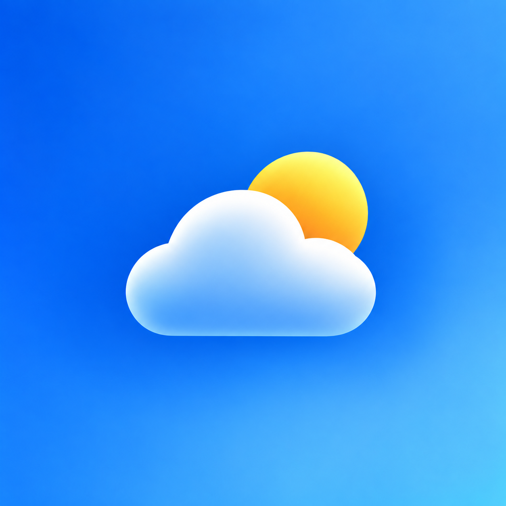
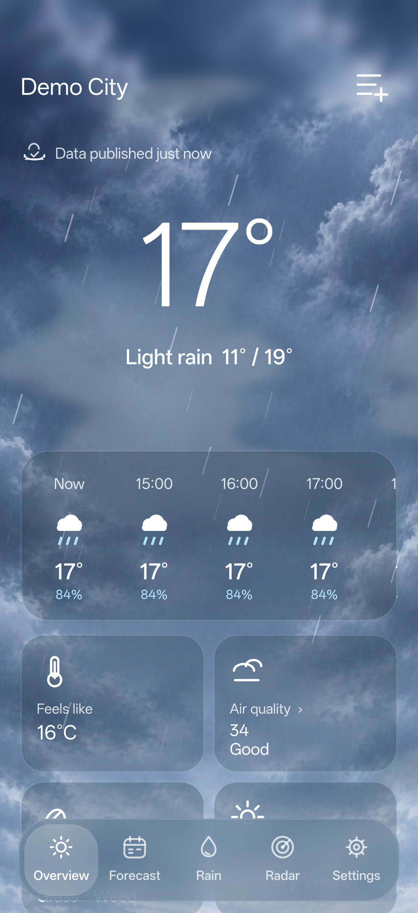
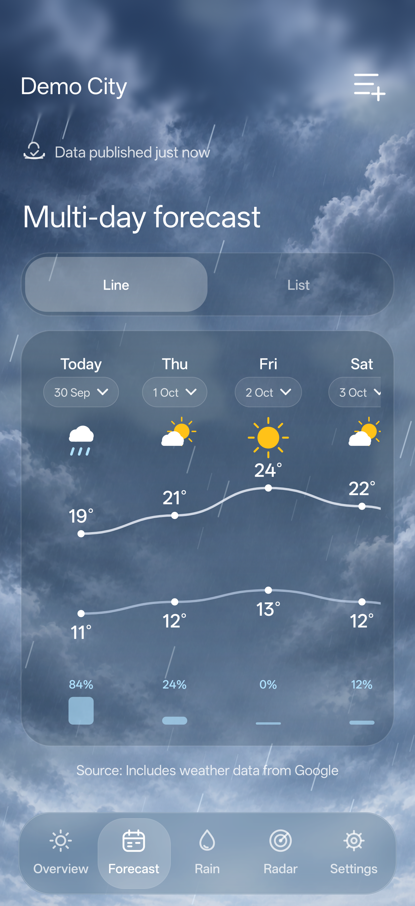
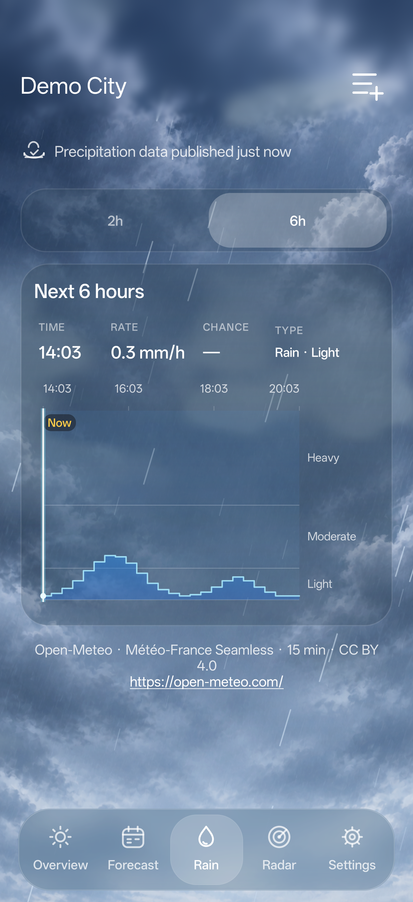
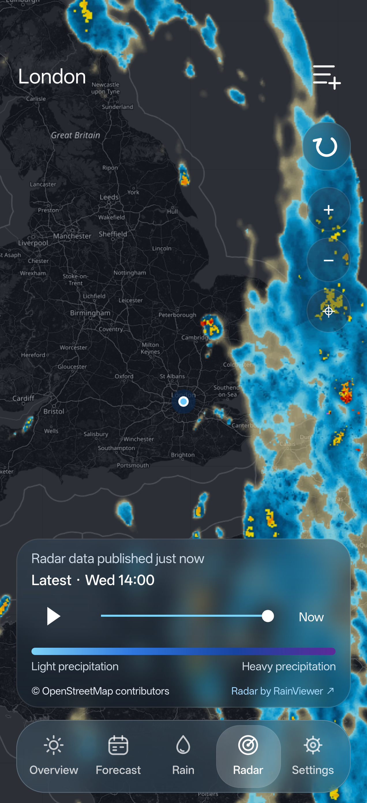
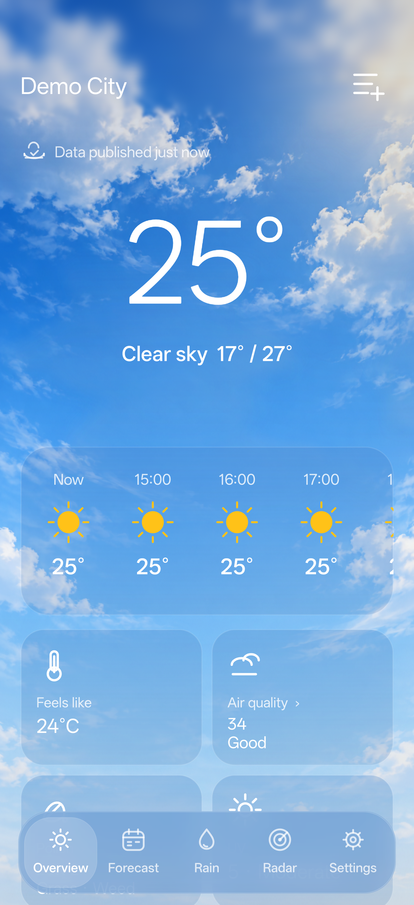
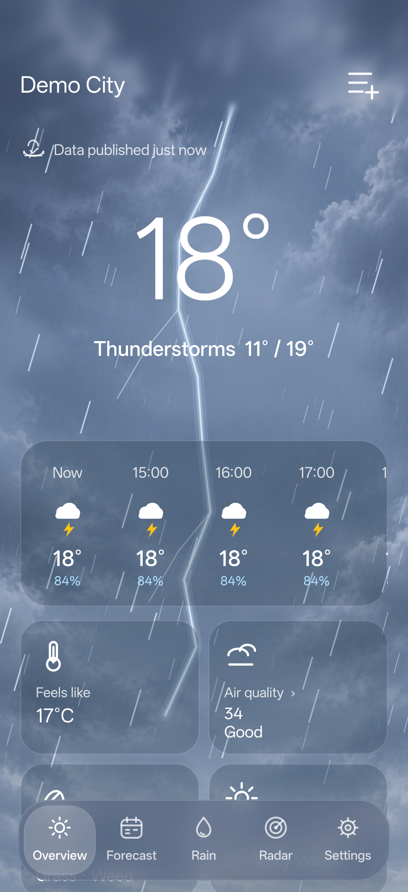
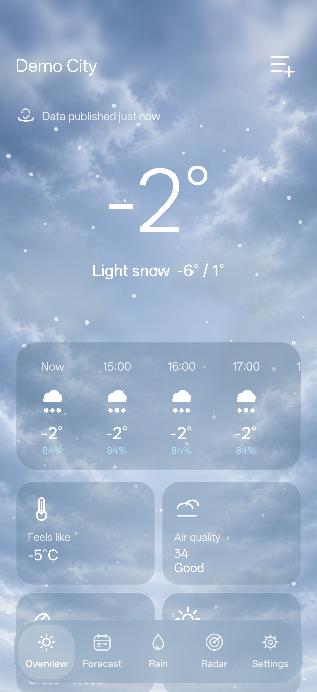

# Zwerk Weather

A weather app for Android with animated skies, clear forecasts, rain graphs, and radar. Check the weather at a glance, explore the days ahead, or keep a forecast on your home screen.

**Android 9+ · Free · Open source · No ads · No account or app subscription required**

[Download the latest release](https://github.com/thibaup/zwerk-weather/releases/latest)

## Take a look

Overview, forecast, precipitation, and radar:

  
  
  
  

Clear skies, thunderstorms, snow, and more have their own animated backgrounds:

  
  
  

*Screenshots captured from the app. “Demo City” uses sample weather; the radar shows real observations over London. The backgrounds animate in the app.*

## Features

- **Weather at a glance.** Current conditions, an hourly forecast, and useful details such as feels-like temperature, wind, humidity, UV, and visibility.
- **Explore the forecast.** Switch between line and list views, expand a day, and open individual hours for more detail.
- **Plan around the rain.** See precipitation amounts and rates over the next 2 or 6 hours.
- **Follow the radar.** Pan, zoom, and play recent radar observations. The map automatically switches between light during the day and dark at night, with manual Light and Dark options too.
- **Animated skies.** Day and night scenes change with the weather, including rain, snow, fog, and thunderstorms.
- **Home-screen widgets.** Choose a weather overview or a six-hour precipitation chart, with adjustable appearance.
- **Make it yours.** Customize glass effects, transparency, units, and card order. Save cities and choose from more than 20 languages.
- **Extra weather details.** Optional air quality and pollen information, depending on your provider and location.

## Getting started

Download the APK from [Releases](https://github.com/thibaup/zwerk-weather/releases) and install it on an Android 9 or newer device. Choose a weather source, then search for a city or use your device location.

**Open-Meteo** works without an API key for noncommercial use. Choose it during setup or in Settings. It is also the default source for the short-term precipitation views.

**Google Weather** is the default source for general forecasts and uses your own Google Cloud API key. Provider charges may apply. Optional Google air-quality and pollen data need their respective APIs enabled.

For setup help and build instructions, see the [configuration and development notes](docs/DEVELOPMENT.md).

## Supporting the project

The app and all its features are free. Donations aren't available yet. If people show interest in supporting the project, I may add an optional donation link later.

## Credits

Weather data: [Open-Meteo](https://open-meteo.com/) and [Google Weather](https://developers.google.com/maps/documentation/weather). Radar observations: [RainViewer](https://www.rainviewer.com/). Map: [OpenStreetMap](https://www.openstreetmap.org/copyright).

Licensed under the [Apache License 2.0](LICENSE).
